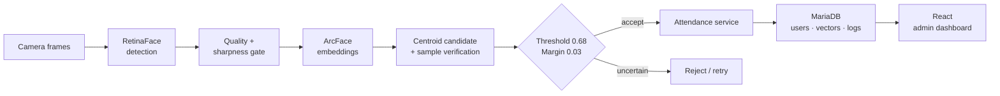

**RetinaFace·ArcFace 인식 파이프라인을 multi-frame enrollment, ambiguity rejection, FastAPI·MariaDB·React 출결 workflow로 연결한 full-stack engineering case study**

[핵심 설계](#세-가지-핵심-판단) · [시스템 구조](#system-architecture) · [개인정보 경계](#privacy--public-scope) · [확장 계획](docs/LEARNING_ROADMAP.md)

---

## 프로젝트 개요

| 구분 | 내용 |
|---|---|
| **Vision** | RetinaFace detection과 ArcFace embedding으로 얼굴 영역과 identity representation을 생성 |
| **Enrollment** | multi-frame quality filtering 후 centroid candidate와 원본 sample을 함께 보존 |
| **Decision rule** | top-1 threshold와 top-2 margin을 동시에 적용해 ambiguous match를 reject |
| **Application** | FastAPI, SQLAlchemy, MariaDB, React/Vite로 등록·식별·IN/OUT 기록·관리 화면을 연결 |
| **Public scope** | 생체정보와 운영 설정을 제외한 architecture, decision rule, trade-off 중심 case study |

`0.68` threshold와 `0.03` margin은 구현 예시값입니다. 실제 환경에는 별도 데이터로 FAR/FRR calibration이 필요합니다.

## Product problem

얼굴 인식 demo와 출결 시스템 사이에는 여러 engineering gap이 있습니다.

- 등록 사진이 흐리거나 한 각도에 치우치면 representation이 불안정합니다.
- top-1 점수만 높다고 동일인이라고 단정할 수 없습니다.
- 같은 사람이 한 frame에서 중복 검출될 수 있습니다.
- 인식 결과를 IN/OUT 상태·사용자·로그 모델과 연결해야 합니다.
- 얼굴 image와 embedding은 생체정보이므로 공개·보관 경계가 필요합니다.

## System architecture

## 세 가지 핵심 판단

### 1 · 등록 품질을 추론보다 먼저 관리

1초 동안 여러 frame을 모으고 선명도 기준을 통과한 얼굴만 사용했습니다. 우연히 잘 나온 한 장보다 다양한 sample을 보관하고 centroid를 후보 탐색에 사용하도록 구성했습니다.

### 2 · 최고 점수만으로 승인하지 않음

top-1 similarity가 threshold를 넘더라도 top-2와 차이가 작으면 identity가 모호합니다. 절대 기준 `0.68`과 후보 간 margin `0.03`을 함께 적용해 ambiguous match를 거절했습니다.

### 3 · 모델 출력을 업무 상태로 변환

식별 성공을 끝으로 두지 않고 최근 기록을 기준으로 IN/OUT을 전환하고, 사용자·embedding·attendance log를 관계형 모델로 분리했습니다.

## Product capabilities

- multi-frame enrollment와 quality filtering
- single / multi-face identification
- 동일 사용자의 중복 검출 정리
- smile·blink 기반 보조 liveness
- 실시간 camera attendance와 IN/OUT 전환
- 사용자·embedding·attendance log 관리
- 관리자용 사용자·로그 화면
- 환경변수 기반 DB·frontend API configuration

## Engineering decisions

| 결정 | 이유 | 남은 검증 |
|---|---|---|
| centroid 후보 + sample 재비교 | 탐색 속도와 개인 내 다양성 동시 반영 | 사용자 규모별 latency |
| threshold + margin gate | 유사한 두 후보 사이의 모호성 거절 | FAR/FRR calibration |
| multi-frame enrollment | blur·각도 편향 완화 | 조건별 등록 품질 실험 |
| liveness를 보조 신호로 한정 | 단순 blink/smile의 보안 한계 인정 | 전문 anti-spoofing 평가 |
| image·embedding 공개 제외 | 생체정보 노출 방지 | 보관·삭제 정책 |

## Privacy & public scope

이 저장소는 **engineering case study**를 공개합니다. 원본 작업 환경에는 실제 얼굴 image, embedding, DB 설정과 운영 configuration이 포함되어 있어 application source snapshot과 개인정보성 artifact는 공개하지 않았습니다.

공개 범위:

- 시스템 architecture와 주요 data flow
- identification decision rule과 설계 근거
- 구현 stack, 기능 범위, engineering trade-off
- 개인정보·보안·운영 한계와 학습 로드맵

실제 운영에는 명시적 동의, 접근 통제, 암호화, 보관 기간, 삭제 절차와 FAR/FRR·spoof robustness 검증이 추가로 필요합니다.

## 기여 범위

사용자 흐름, 등록·식별 전략, decision rule, API·DB·frontend 통합과 반복 검증을 맡았습니다. threshold의 해석 범위와 생체정보를 포함한 비공개 경계를 별도로 검토했습니다.

[모델 평가·보안·운영 확장 로드맵](docs/LEARNING_ROADMAP.md)

