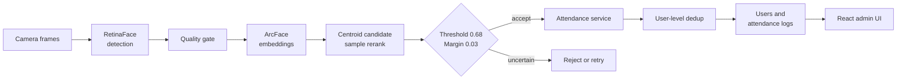

**기존 얼굴 출결 시스템에서 흐린 등록 사진과 닮은 얼굴로 생기는 오승인을 줄이도록 식별 흐름을 고도화했습니다.**

[변경 내용](#변경-내용) · [판정 흐름](#판정-흐름) · [시스템 범위](#시스템-범위) · [남은 검증](#남은-검증)

> 이 저장소는 기존 시스템을 어떻게 고도화했는지 정리한 설계 사례입니다. 실제 얼굴 image, embedding, DB 설정과 application source는 포함하지 않으므로 실행 가능한 공개 구현으로 보지 않아야 합니다.

## 문제

기존 시스템은 한 장의 등록 사진과 similarity threshold를 중심으로 사용자를 식별했습니다. 실제 테스트에서는 조명, 명암과 촬영 위치가 바뀌었을 때 닮은 사람이 잘못 승인되는 사례가 있었습니다.

등록과 출퇴근 단계에 모두 많은 frame을 사용하면 응답 시간이 길어졌고, 한 화면에서 같은 사용자가 여러 detection에 중복 연결되는 문제도 있었습니다.

이 작업은 얼굴 인식 model을 새로 학습한 연구가 아닙니다. 기존 시스템에서 확인한 failure case를 바탕으로 등록, 후보 검색과 승인 정책을 고친 system hardening 작업입니다.

## 변경 내용

| 기존 방식 | 변경 | 판단 근거 |
|---|---|---|
| Single-image enrollment | Multi-frame 등록 + quality filtering | 흐린 한 장이 사용자 특징 전체를 결정하지 않도록 했습니다. |
| Centroid-only matching | Centroid 후보 탐색 + 등록 sample 재비교 | 평균값이 가리는 조명과 각도 차이를 개별 sample에서 다시 확인했습니다. |
| Absolute threshold | Top-1 threshold + top-2 margin | 두 후보가 비슷하면 최고 점수가 기준을 넘어도 승인하지 않았습니다. |
| Detection별 독립 식별 | User-level dedup | 여러 얼굴 입력에서 한 사용자가 중복 승인되는 것을 막았습니다. |
| 등록과 출결 모두 다중 추론 | 등록은 풍부하게, 출결은 가볍게 | 반복 사용되는 출결 단계의 지연을 줄였습니다. |

구현 과정에서 사용한 예시 기준은 sharpness 35, cosine-distance threshold 0.68, top-1/top-2 margin 0.03입니다. 운영 데이터로 calibration을 끝낸 값은 아닙니다.

## 판정 흐름

먼저 centroid로 사용자 후보를 줄인 뒤 해당 사용자의 등록 sample과 query를 다시 비교합니다. Top-1이 threshold를 넘더라도 top-2와의 차이가 작으면 승인하지 않습니다.

모델이 이름을 반환하는 것으로 끝내지 않고 식별 결과를 사용자, 최근 IN/OUT 기록과 runtime log에 연결했습니다. 모호한 결과는 출결로 기록하지 않고 재촬영하도록 했습니다.

## 시스템 범위

- RetinaFace detection과 ArcFace embedding
- FastAPI API와 SQLAlchemy, MariaDB data model
- React, Vite, TypeScript 관리 화면
- 등록, single/multi-face 식별, 출결 기록과 runtime log
- Smile/blink liveness 보조 실험

위 항목은 비공개 application의 구성 범위입니다. 해당 source가 이 저장소에 포함됐다는 뜻은 아닙니다.

## 공개 범위

| 포함 | 미포함 |
|---|---|
| Architecture, data flow, decision rule | 실제 얼굴 image와 embedding |
| 기존 방식과 변경 내용 | 실행 가능한 application source |
| 예시 threshold와 margin | DB credential과 deployment config |
| 후속 평가 계획 | FAR, FRR와 latency 결과 |

## 남은 검증

- FAR, FRR 기반 threshold와 margin calibration
- Single-frame 대비 multi-frame enrollment ablation
- Centroid-only 대비 sample rerank ablation
- 사진과 영상 재생 공격에 대한 liveness 검증
- 동시 요청, 권한, 암호화와 배포 설정
- 사용자 동의와 생체정보 보관, 삭제 정책

정량 평가가 공개되기 전까지 특정 개선율이나 운영 성능을 주장하지 않습니다.

[Evaluation and deployment roadmap](docs/LEARNING_ROADMAP.md)
