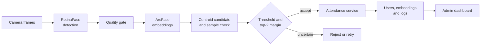

**등록 품질과 모호성 거절을 기존 얼굴 출결 업무 흐름에 연결한 시스템 고도화 프로젝트**

[문제와 목표](#문제와-목표) · [고도화 방식](#고도화-방식) · [시스템 구조](#시스템-구조) · [공개 범위](#공개-범위)

---

> 기존 출결 애플리케이션을 분석하고 식별 판정과 업무 흐름을 고도화한 작업입니다. 실제 얼굴 image, embedding, DB 설정과 application source snapshot은 포함하지 않습니다.

## 프로젝트 맥락

| 구분 | 내용 |
|---|---|
| 작업 성격 | 기존 얼굴 출결 시스템 고도화 |
| 담당 | 등록 품질, 식별 판정과 API·DB·UI 연결 개선 방향 설계 |
| 구현 방식 | Codex를 활용해 기능 구현과 반복 검증을 진행 |
| 공개 범위 | architecture, data flow, decision rule과 검증 계획 |

## 문제와 목표

얼굴 인식 모델의 top-1 결과를 출석 처리에 바로 사용하면 흐린 등록 사진이나 비슷한 후보 때문에 잘못된 기록이 남을 수 있습니다. 모델이 이름을 반환해도 사용자, 최근 출결 상태와 로그에 연결되지 않으면 실제 출결 업무는 끝나지 않습니다.

기존 시스템의 등록, 식별, 승인과 기록 흐름을 나눠 확인하고, multi-frame enrollment와 ambiguity rejection을 RetinaFace·ArcFace 식별 및 FastAPI·MariaDB·React 출결 흐름에 연결했습니다. 불확실한 결과는 출석으로 기록하지 않고 재시도하도록 설계했습니다.

## 고도화 방식

| 변경 | 적용 방식 | 이유 |
|---|---|---|
| 등록 품질 보강 | 짧은 구간의 여러 frame 중 품질 기준을 통과한 sample만 저장 | 흐림, 각도와 표정이 있는 한 장이 사용자 특징 전체를 결정하지 않게 했습니다. |
| 후보 모호성 거절 | Top-1 similarity와 top-2 margin을 함께 확인 | 최고 점수가 기준을 넘어도 두 후보가 비슷하면 잘못 승인될 수 있기 때문입니다. |
| 업무 기록 연결 | 승인된 identity를 최근 기록과 연결해 IN/OUT 상태 전환 | 얼굴 인식 결과를 사용자와 attendance log까지 이어 실제 업무 단위로 만들었습니다. |

등록 단계에는 다양한 sample을 남기고 반복 사용되는 출결 단계는 가볍게 유지하도록 계산량을 나눴습니다. 구현 과정에서 사용한 선명도 약 `35`, similarity threshold `0.68`, margin `0.03`은 예시값이며 운영 환경에서 보정한 기준이 아닙니다.

## 시스템 구조

고도화 범위에는 multi-frame enrollment, single·multi-face identification, 중복 정리, threshold·margin rejection, 보조적인 smile·blink liveness signal과 API·DB·UI 연결이 포함됩니다.

## 공개 범위

이 저장소는 완성 제품 전체가 아니라 기존 시스템을 어떻게 고도화했는지 정리한 case study입니다. 공개 내용은 architecture, data flow, decision rule, 기능 범위와 trade-off입니다. 실제 얼굴 image와 embedding은 생체정보이므로 제외했습니다.

FAR·FRR calibration, spoof robustness, 동시성, 권한과 배포는 현재 공개 자료에서 검증하지 않았습니다. 실제 운영에는 사용자 동의, 접근 통제, 암호화와 보관·삭제 정책도 필요합니다. 남은 항목은 [미구현 평가·보안·배포 계획](docs/LEARNING_ROADMAP.md)에 있습니다.

## 기여

기존 출결 시스템의 사용자 흐름과 식별 과정을 분석하고, 닮은 얼굴의 오승인 사례를 바탕으로 multi-frame 등록, sample 재비교와 ambiguity rejection 방향을 설계했습니다. API·DB·frontend 연결과 테스트에는 Codex를 활용했으며, 생체정보가 포함된 원본과 공개 가능한 설계 자료의 경계도 정했습니다. 기여 범위는 기존 시스템 이후의 고도화 작업입니다.
