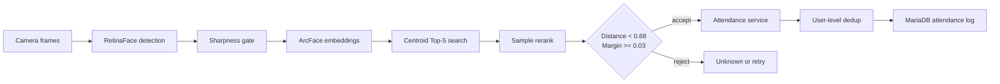

<div align="center">

**다중 프레임 등록과 모호성 거부 규칙을 적용한 얼굴 인식 출결 시스템**


[구현 범위](#구현-범위) · [판정 흐름](#판정-흐름) · [실행](#로컬-실행) · [검증 경계](#검증-경계)

</div>

## 문제

초기 시스템은 사용자당 한 장의 등록 이미지와 절대 임계값을 중심으로 얼굴을 식별했습니다. 현재 구현은 흐린 등록 프레임, 서로 가까운 두 후보, 한 이미지에서 같은 사용자가 중복 검출되는 경우를 별도로 처리하도록 확장했습니다.

이 저장소에는 실제 FastAPI 백엔드와 React/Vite 프론트엔드 소스가 포함됩니다. 실제 얼굴 이미지, 얼굴 임베딩, DB 접속값, 관리자 비밀번호와 MediaPipe 모델 파일은 포함하지 않습니다.

## 구현 범위

| 영역 | 현재 코드에 구현된 동작 |
|---|---|
| 얼굴 모델 | RetinaFace로 얼굴을 검출하고 ArcFace로 512차원 임베딩 생성 |
| 사용자 등록 | 3~10개 프레임 입력, Laplacian sharpness 35 미만 제외, sample embedding과 정규화 centroid 저장 |
| 1:N 검색 | centroid 거리 기준 Top-5 후보 선택 후 후보별 sample embedding으로 재비교 |
| 승인 규칙 | cosine distance `< 0.68` 및 서로 다른 사용자 Top-1/Top-2 margin `>= 0.03` |
| 출결 처리 | 최근 기록이 없거나 OUT이면 IN, 최근 기록이 IN이면 OUT |
| 실시간 경로 | 3~5개 프레임 중 가장 선명한 한 장만 ArcFace 추론하는 V4 경로 |
| 다중 얼굴 | 사진 속 여러 얼굴을 각각 식별하고 동일 사용자 중복 출결 기록 방지 |
| 라이브니스 | smile 기반 경로와 MediaPipe Face Landmarker 기반 2회 blink 경로 |
| 운영 화면 | 등록, 단일 출결, 다중 얼굴 식별/출결, 사용자 조회·삭제, 서버 로그 조회 |

sharpness `35`, cosine-distance threshold `0.68`, margin `0.03`은 코드에 적용된 기준값입니다. FAR/FRR 기반 운영 데이터 보정이 완료된 값은 아닙니다.

## 판정 흐름



등록 단계에서는 여러 프레임을 보존하고, 반복 사용되는 출결 단계에서는 가장 선명한 프레임 하나만 임베딩합니다. 다중 얼굴 출결은 얼굴별 판정 후 사용자 ID 기준으로 가장 가까운 결과 하나만 기록합니다.

## 저장소 구조

```text
backend/   FastAPI, DeepFace, SQLAlchemy, MariaDB schema
frontend/  React 19, Vite, TypeScript UI
docs/      미완료 평가·보안·배포 항목
assets/    공개 문서용 이미지
```

핵심 코드는 다음 위치에서 확인할 수 있습니다.

- [`FaceAnalysisService.create_embedding`](backend/app/services/face_service.py): ArcFace + RetinaFace 임베딩
- [`find_closest_match_user_level_with_reason`](backend/app/services/face_service.py): cosine distance, threshold, margin gate
- [`register_user_v2`](backend/app/routers/face.py): 다중 프레임 등록과 centroid 생성
- [`check_in_out_v4`](backend/app/routers/attendance.py): best-frame 출결 경로
- [`check_in_out_multi_image`](backend/app/routers/attendance.py): 다중 얼굴과 동일 사용자 중복 제거

## 로컬 실행

### 1. MariaDB

전용 로컬 DB에서 [`backend/db_reset_v2.sql`](backend/db_reset_v2.sql)을 실행합니다. 이 스크립트는 `attendance_db`를 삭제한 뒤 다시 생성하므로 기존 DB에는 실행하면 안 됩니다.

### 2. 백엔드

Python 3.10~3.12 환경을 권장합니다. Python 3.13에서는 프로젝트 작업 당시 MediaPipe 호환 문제가 확인됐습니다.

```powershell
cd backend
Copy-Item .env.example .env
python -m venv .venv
.venv\Scripts\Activate.ps1
python -m pip install -r requirements.txt
uvicorn app.main:app --reload
```

`.env`의 DB 계정과 `LIVENESS_ADMIN_PASSWORD`는 로컬 값으로 변경해야 합니다. 비밀번호가 없으면 라이브니스 설정 변경을 거부합니다. 허용할 프론트엔드 주소는 `CORS_ORIGINS`에서 지정합니다. API 문서는 `http://127.0.0.1:8000/docs`에서 확인할 수 있습니다.

Blink 라이브니스를 사용하려면 MediaPipe Face Landmarker 모델을 `backend/models/face_landmarker.task`에 별도로 배치해야 합니다. 모델 파일은 저장소에 포함되지 않습니다.

### 3. 프론트엔드

```powershell
cd frontend
Copy-Item .env.example .env
npm ci
npm run dev
```

기본 UI 주소는 `http://127.0.0.1:5173`입니다.

## 검증 경계

확인된 검증은 Python 소스 구문 검사, 출결 IN/OUT 전환 unit test와 TypeScript/Vite 프로덕션 빌드입니다. 얼굴 데이터셋 기반 accuracy, FAR, FRR, ROC, 지연시간 비교 수치는 현재 저장소에 없으므로 성능 성과로 주장하지 않습니다.

현재 공개본은 로컬 연구용 prototype입니다. 사용자·로그 관리 API의 인증, HTTPS, 임베딩 암호화와 보관 정책은 포함하지 않았으므로 외부 네트워크에 그대로 공개하면 안 됩니다.

추가로 필요한 검증과 운영 항목은 [평가·보안·배포 계획](docs/LEARNING_ROADMAP.md)에 분리했습니다.

## 개인정보 범위

다음 파일은 Git에 포함되지 않습니다.

- 실제 사용자 얼굴 이미지와 `.npy` 임베딩
- `.env`와 DB 접속 정보
- 라이브니스 관리자 비밀번호와 변경 이력
- DeepFace/MediaPipe 모델 가중치
- 가상환경, 로그와 빌드 산출물
