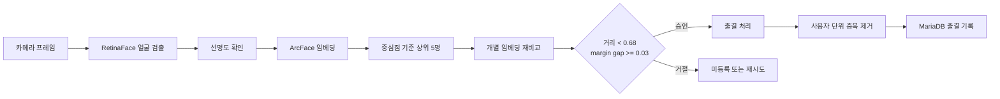

<div align="center">

# 기존 얼굴 출결 시스템 고도화

**실제 촬영 환경에서 오승인을 확인하고, 등록 방식과 얼굴 판정 기준을 다시 설계했습니다.**


[문제](#실제-사용-상황에서-발견한-문제) · [해결 흐름](#문제를-해결한-흐름) · [구현](#현재-구현) · [판정](#얼굴을-판정하는-과정) · [실행](#로컬에서-실행하기)

</div>

## 실제 사용 상황에서 발견한 문제

이 프로젝트는 얼굴 등록과 인식 기능이 이미 있던 출결 시스템에서 시작했습니다. 초기 버전은 사용자마다 사진 한 장을 저장하고, 입력 얼굴과 가장 가까운 후보가 거리 임계값을 통과하면 출결을 승인했습니다.

실제 사용 상황을 가정해 조명, 명암과 촬영 위치를 바꿔 테스트하던 중 닮은 사람이 잘못 승인되는 사례가 나왔습니다. 당시 판정은 가장 가까운 후보가 거리 임계값만 넘으면 승인하는 방식이었습니다. 1순위와 2순위 후보의 점수가 거의 같아도 둘 중 한 명을 선택할 수 있었습니다.

이 실패 사례를 기준으로 등록 데이터, 후보 검색과 최종 승인 조건을 차례로 확인했습니다. 프로젝트의 초점은 실제 문제를 재현하고, 원인을 판정식까지 내려가 수정한 뒤 처리시간을 고려해 구현 방식을 조정하는 과정에 있습니다.

## 문제를 해결한 흐름

| 단계 | 확인한 문제와 결정 |
|---|---|
| 실패 재현 | 조명과 촬영 위치를 바꿔 테스트하며 닮은 사람이 승인되는 사례를 확인했습니다. |
| 원인 확인 | 절대 거리만 보면 1순위와 2순위 후보가 거의 같은 모호한 상황을 구분할 수 없었습니다. |
| 등록 개선 | 사진 한 장 대신 3~10개 프레임을 받고, 흐린 이미지를 제외한 뒤 개별 임베딩과 사용자 중심점을 저장했습니다. |
| 후보 검색 | 중심점으로 상위 후보를 빠르게 좁힌 뒤 각 후보의 개별 임베딩을 다시 비교했습니다. |
| 승인 기준 | 거리 임계값과 함께 Top-1·Top-2의 차이인 margin gap을 추가했습니다. 가장 가까운 후보가 충분히 가깝고 다른 후보와도 구분될 때만 승인합니다. |
| 처리시간 조정 | 등록할 때는 여러 장을 저장하고, 반복되는 출결에서는 가장 선명한 한 장만 추론하도록 바꿨습니다. |
| 다중 얼굴 처리 | 같은 사용자가 여러 얼굴 검출 결과에 중복 매핑되면 사용자 단위로 하나만 남겼습니다. |

등록과 출결에는 서로 다른 계산량을 적용했습니다. 등록 단계에서는 사용자 표현을 넓히고, 자주 실행되는 출결 단계에는 필요한 계산만 남겼습니다.

## 현재 구현

| 영역 | 현재 구현 |
|---|---|
| 얼굴 표현 | RetinaFace로 얼굴을 찾고 ArcFace로 512차원 임베딩 생성 |
| 사용자 등록 | 3~10개 프레임을 받아 선명도 35 미만을 제외하고 개별 임베딩과 정규화 중심점 저장 |
| 후보 검색 | 중심점 거리로 상위 5명을 고른 뒤 각 후보의 개별 임베딩을 다시 비교 |
| 승인 조건 | cosine distance `< 0.68`이고 서로 다른 사용자의 Top-1·Top-2 margin gap이 `0.03` 이상일 때 승인 |
| 출결 처리 | 3~5개 프레임 가운데 가장 선명한 한 장으로 임베딩 생성 |
| 여러 얼굴 | 얼굴별로 식별한 뒤 같은 사용자가 한 이미지에서 두 번 기록되지 않도록 정리 |
| 출결 전환 | 최근 기록이 없거나 OUT이면 IN, 최근 기록이 IN이면 OUT |
| 라이브니스 | 미소 기반 방식과 MediaPipe Face Landmarker의 두 번 깜박임 방식 |
| 관리 화면 | 등록, 출결, 여러 얼굴 식별, 사용자 조회·삭제와 서버 로그 확인 |

선명도 `35`, 거리 임계값 `0.68`, 후보 차이 `0.03`은 현재 코드에 들어 있는 기준입니다. 운영 환경에서 FAR과 FRR을 측정해 정한 최종값은 아닙니다.

## 얼굴을 판정하는 과정



등록 단계에서는 촬영 조건이 다른 얼굴을 여러 장 저장합니다. 출결 단계에서는 가장 선명한 프레임 하나만 임베딩해 반복 처리의 계산량을 줄였습니다. 여러 얼굴이 들어온 사진은 얼굴별로 판정한 뒤 사용자 ID가 같은 결과 가운데 거리가 가장 가까운 하나만 기록합니다.

### 코드에서 확인할 위치

- [`FaceAnalysisService.create_embedding`](backend/app/services/face_service.py): RetinaFace 검출과 ArcFace 임베딩 생성
- [`find_closest_match_user_level_with_reason`](backend/app/services/face_service.py): 거리 임계값과 후보 차이를 함께 보는 판정
- [`register_user_v2`](backend/app/routers/face.py): 다중 프레임 등록과 중심점 생성
- [`check_in_out_v4`](backend/app/routers/attendance.py): 가장 선명한 프레임을 이용한 출결
- [`check_in_out_multi_image`](backend/app/routers/attendance.py): 여러 얼굴 판정과 사용자 중복 제거

## 로컬에서 실행하기

### 1. MariaDB 준비

전용 로컬 DB에서 [`backend/db_reset_v2.sql`](backend/db_reset_v2.sql)을 실행합니다. 이 스크립트는 `attendance_db`를 삭제하고 다시 만들기 때문에 기존 DB에는 실행하면 안 됩니다.

### 2. 백엔드

Python 3.10~3.12 환경을 권장합니다. 프로젝트 작업 당시 Python 3.13에서는 MediaPipe 호환 문제가 있었습니다.

```powershell
cd backend
Copy-Item .env.example .env
python -m venv .venv
.venv\Scripts\Activate.ps1
python -m pip install -r requirements.txt
uvicorn app.main:app --reload
```

`.env`의 DB 계정과 `LIVENESS_ADMIN_PASSWORD`를 로컬 값으로 바꿔야 합니다. 비밀번호가 없으면 라이브니스 설정을 변경할 수 없습니다. 프론트엔드 주소는 `CORS_ORIGINS`에서 지정합니다. API 문서는 `http://127.0.0.1:8000/docs`에서 볼 수 있습니다.

깜박임 라이브니스를 사용하려면 MediaPipe Face Landmarker 모델을 `backend/models/face_landmarker.task`에 따로 배치해야 합니다. 모델 파일은 저장소에 포함하지 않았습니다.

### 3. 프론트엔드

```powershell
cd frontend
Copy-Item .env.example .env
npm ci
npm run dev
```

기본 화면은 `http://127.0.0.1:5173`에서 열립니다.

## 저장소 구성

```text
backend/   FastAPI, DeepFace, SQLAlchemy, MariaDB 스키마
frontend/  React 19, Vite, TypeScript 화면
docs/      평가, 보안과 배포 전에 확인할 항목
assets/    공개 문서용 이미지
```

## 현재 확인한 범위

자동화 검사에서는 Python 코드 구문, 출결 IN/OUT 전환 단위 테스트와 TypeScript/Vite 프로덕션 빌드를 확인합니다. 얼굴 데이터셋을 이용한 정확도, FAR, FRR, ROC와 지연시간 비교는 아직 하지 않았습니다. 따라서 현재 구현을 성능 향상 수치로 설명하지 않습니다.

공개본은 로컬 연구용 프로토타입입니다. 사용자와 로그 관리 API의 인증, HTTPS, 임베딩 암호화와 보관 정책은 포함하지 않았습니다. 외부 네트워크에 그대로 배포하면 안 됩니다. 후속 평가와 운영 항목은 [평가·보안·배포 계획](docs/LEARNING_ROADMAP.md)에 정리했습니다.

실제 사용자 얼굴 이미지와 임베딩, `.env`, DB 접속 정보, 관리자 비밀번호, 모델 가중치, 로그와 빌드 결과물은 Git에 포함하지 않았습니다.
