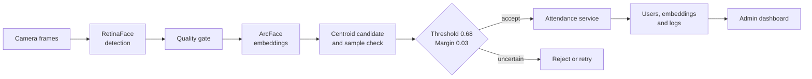

**등록 품질과 모호성 거절을 기존 얼굴 출결 업무 흐름에 연결한 시스템 고도화 프로젝트**

[핵심 설계](#핵심-설계) · [시스템 구조](#시스템-구조) · [공개 범위](#공개-범위) · [미구현 검증](docs/LEARNING_ROADMAP.md)

---

> 기존 출결 애플리케이션을 분석하고 식별 판정과 업무 흐름을 고도화한 작업입니다. 실제 얼굴 image, embedding, DB 설정과 application source snapshot은 포함하지 않습니다.

## 프로젝트 맥락

| 구분 | 내용 |
|---|---|
| 작업 성격 | 기존 얼굴 출결 시스템 고도화 |
| 담당 | 등록 품질, 식별 판정과 API·DB·UI 연결 개선 방향 설계 |
| 구현 방식 | Codex를 활용해 기능 구현과 반복 검증을 진행 |
| 공개 범위 | architecture, data flow, decision rule과 검증 계획 |

## 운영 제약

얼굴 인식 모델의 top-1 결과를 출석 처리에 바로 사용하면 흐린 등록 사진, 비슷한 후보와 중복 검출 때문에 잘못된 기록이 남을 수 있습니다. 실제 테스트에서도 닮은 얼굴이 조명, 대비와 촬영 위치에 따라 잘못 승인되는 사례가 있었습니다. 모델이 이름을 반환해도 사용자, 최근 출결 상태와 로그에 연결되지 않으면 업무가 끝나지 않습니다. 생체정보를 다루므로 불확실한 결과를 승인하지 않는 기준과 데이터 공개 범위도 필요합니다.

## 고도화 질문

> 기존 얼굴 출결 흐름에서 등록 품질이 낮거나 후보가 모호할 때 잘못된 승인을 줄이고, 식별 결과를 안정적으로 IN/OUT 기록까지 연결할 수 있는가?

이 저장소는 완성 제품 전체를 공개한 저장소가 아니라 고도화 과정과 판단 기준을 정리한 case study입니다. 기존 흐름을 분석한 뒤 RetinaFace와 ArcFace 기반 식별에 multi-frame enrollment와 ambiguity rejection을 보강하고, FastAPI·MariaDB·React 출결 흐름까지 연결했습니다. 아직 운영 데이터로 검증하지 않은 기준은 따로 표시했습니다.

## 접근과 선택 이유

기존 시스템을 등록, 식별, 승인과 출결 기록으로 나눠 병목을 확인했습니다. 처음에는 top-1 threshold로만 승인 여부를 판단했지만, 닮은 후보가 기준을 넘는 사례를 확인한 뒤 top-1과 top-2의 차이까지 보는 방식으로 바꿨습니다. 여러 frame으로 등록 품질을 보완하고 불확실한 결과는 기록하지 않고 재시도하도록 설계했습니다.

### 왜 한 장이 아니라 여러 frame을 등록했는가

한 장의 등록 사진은 흐림, 각도와 표정에 크게 좌우됩니다. 짧은 구간에서 여러 frame을 받고 품질 기준을 통과한 sample만 남겨, 우연히 잘못 잡힌 한 장이 사용자 특징 전체를 결정하지 않도록 했습니다. 선명도 기준 약 `35`는 구현 과정에서 사용한 예시값이며, 운영 환경에서 보정이 끝난 기준은 아닙니다.

등록과 출결 단계에 모두 많은 embedding을 사용하면 응답 시간이 늘어났습니다. 그래서 등록 단계에는 더 다양한 sample을 남기고, 반복 사용되는 출결 단계는 가볍게 유지하는 쪽으로 계산량을 나눴습니다.

### 왜 top-1 threshold만 사용하지 않았는가

최고 점수가 기준을 넘더라도 두 후보의 점수가 비슷하면 누구인지 확신하기 어렵습니다. Top-1과 top-2의 차이도 함께 확인해 모호한 경우는 기록하지 않고 재시도하도록 설계했습니다. 잘못된 출석 한 건의 수정 비용이 재촬영보다 크다는 판단을 반영했습니다.

### 왜 모델과 출결 업무를 함께 설계했는가

얼굴을 찾고 이름을 반환하는 demo만으로는 출결 상태가 완성되지 않습니다. 식별 결과를 최근 IN/OUT 기록, 사용자와 로그에 연결해야 실제 업무 흐름이 됩니다. 그래서 vision model의 출력 형식부터 API와 DB 상태 전환까지 한 흐름으로 보았습니다.

## 시스템 구조

## 핵심 설계

### 등록 품질

1초 동안 여러 frame을 모으고 선명도 기준을 통과한 sample만 사용합니다. Centroid는 후보 탐색에 쓰고 원본 sample과 다시 비교해 개인 내 변화를 반영합니다.

### 모호한 후보 거절

Top-1 similarity가 threshold를 넘더라도 top-2와 차이가 작으면 승인하지 않습니다. 구현 예시값은 threshold `0.68`, margin `0.03`이며 운영 기준으로 검증된 값은 아닙니다.

### 업무 기록 연결

승인된 identity는 최근 기록을 기준으로 IN/OUT 상태를 전환합니다. 사용자, embedding과 attendance log는 관계형 모델로 분리합니다.

## 고도화 범위

- multi-frame enrollment와 quality filtering
- single·multi-face identification과 중복 정리
- threshold와 top-2 margin 기반 rejection
- 보조적인 smile·blink liveness signal
- FastAPI, SQLAlchemy, MariaDB와 React 관리 흐름

## 공개 범위

공개 내용은 기존 시스템에서 개선한 architecture, data flow, decision rule, 기능 범위와 trade-off입니다. 실제 얼굴 image와 embedding은 생체정보이므로 제외했습니다.

실제 운영에는 사용자 동의, 접근 통제, 암호화, 보관·삭제 정책이 필요합니다. FAR과 FRR calibration, spoof robustness, 동시성, 권한과 배포 검증도 현재 공개 저장소에서 완료하지 않았습니다.

## 기여

기존 출결 시스템의 사용자 흐름과 식별 과정을 분석하고, 닮은 얼굴의 오승인 사례를 바탕으로 multi-frame 등록, sample 재비교와 ambiguity rejection 방향을 설계했습니다. API·DB·frontend 연결과 테스트에는 Codex를 활용했으며, 생체정보가 포함된 원본과 공개 가능한 설계 자료의 경계도 정했습니다. 기여 범위는 기존 시스템 이후의 고도화 작업입니다.

[미구현 평가·보안·배포 계획](docs/LEARNING_ROADMAP.md)
