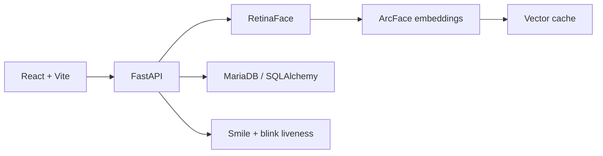

# Face Attendance System

> 다중 얼굴 인식, 실제 사람 확인(liveness), 출퇴근 기록을 하나의 흐름으로 연결한 웹 기반 출석 시스템입니다.

**Status:** Working prototype · Frontend build verified · Backend syntax verified

## 주요 기능

- 1초 동안 여러 프레임을 수집하고 선명도 기준을 통과한 얼굴만 등록
- ArcFace embedding과 RetinaFace detection 기반 사용자 식별
- centroid로 후보를 찾은 뒤 개별 sample과 다시 비교하는 2단계 검색
- cosine threshold `0.68`과 top-1/top-2 margin `0.03`을 함께 적용
- smile 및 blink liveness
- 한 화면에서 여러 얼굴을 인식하고 동일 사용자의 중복 검출을 정리
- 최근 기록을 기준으로 IN/OUT 상태 자동 전환

## 시스템 구성

## 내가 주도한 부분

- 등록·식별·liveness·출석 기록을 연결한 전체 사용자 흐름 설계
- 단일 이미지 등록을 다중 프레임 + quality filter 방식으로 개선
- 단일 대표 벡터 검색을 centroid 후보 검색 + sample 재비교로 개선
- threshold만 사용하던 판정을 margin gate와 함께 사용하도록 개선
- 실시간 비용을 줄이기 위해 다중 embedding 평균 방식에서 가장 선명한 프레임 선택 방식으로 조정
- 다중 얼굴에서 같은 사용자가 여러 번 잡히는 문제를 사용자별 best face 선택으로 해결
- MediaPipe `solutions` 호환 문제를 Tasks API 방식으로 전환

## 데이터 모델

- `users`: 사용자 기본 정보
- `user_embeddings`: 사용자별 얼굴 embedding sample
- `attendance_log`: IN/OUT 출석 이력

서버는 얼굴 등록·식별·다중 식별·시각화·사용자 관리·출석·liveness·로그·health endpoint를 제공합니다. 화면은 Home, Register, Multi Identify, Multi Live Attendance, DB, Logs로 구성했습니다.

## 검증된 범위

- React/Vite production build 성공
- FastAPI 주요 Python 파일 문법 검사 통과
- 과거 실행 로그에서 `0.0.0.0:5011` 서버 구동 확인

## 현재 한계

- 공개 저장소에는 개인정보, 실제 얼굴 이미지, embedding, 비밀키를 포함하지 않습니다.
- 실제 운영 환경의 FAR/FRR, 조명·각도별 성능, spoof 공격 강건성은 별도 검증이 필요합니다.
- liveness는 상용 anti-spoofing 수준의 보안을 보장하지 않습니다.

## 다음 구현 목표

- [ ] 익명화된 demo 데이터와 설치 스크립트
- [ ] 등록·식별·출석 API 통합 테스트
- [ ] threshold calibration과 FAR/FRR 리포트
- [ ] Docker Compose 및 DB migration
- [ ] 구조화 로그·metrics·health check
- [ ] 얼굴 데이터 보관·삭제 정책 문서화

자세한 학습 계획은 [LEARNING_ROADMAP.md](docs/LEARNING_ROADMAP.md)에 정리했습니다.

## 개발 방식

AI 코딩 도구를 구현과 오류 해결에 적극 활용했습니다. 요구사항, 사용자 흐름, 모델·검색 방식 선택, 반복 개선과 검증 기준은 직접 주도했습니다. 공개 버전은 개인정보를 제거하고 테스트 가능한 형태로 재구성합니다.

