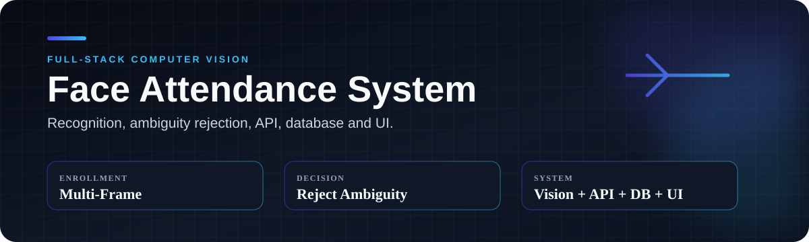
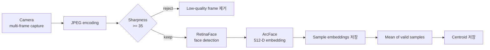
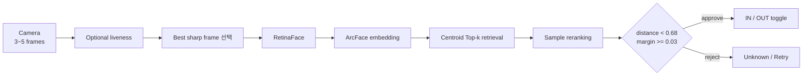
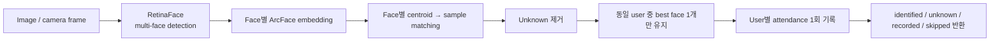

<div align="center">

# Face Attendance System Upgrade

**닮은 사용자를 잘못 승인하는 오인식 문제를 확인하고, 등록 데이터 구성부터 후보 검색·최종 승인까지 얼굴 출결 판정 구조를 다시 설계했습니다.**


[문제](#1-어떤-문제를-고도화했는가) · [변화](#2-문제를-판정-파이프라인으로-풀기) · [설계](#3-왜-이-설계를-선택했는가) · [흐름](#4-등록부터-출결까지의-흐름) · [구현](#5-현재-구현-범위) · [검증](#8-검증된-것과-아직-검증하지-않은-것)

</div>

## 1. 어떤 문제를 고도화했는가

이 프로젝트는 얼굴 등록과 인식 기능이 이미 있던 출결 시스템에서 시작했습니다. 초기 버전은 사용자마다 대표 임베딩 하나를 저장하고, 입력 얼굴과 가장 가까운 후보가 거리 임계값을 통과하면 출결을 승인하는 구조였습니다.

조명, 명암과 촬영 위치를 바꿔 테스트하던 중 닮은 사람이 잘못 승인되는 사례를 확인했습니다. 가장 가까운 사람이 있다는 것과 그 사람이라고 확신할 수 있다는 것은 다른 문제였습니다. `threshold` 하나를 다시 조정하면 1순위와 2순위 후보가 얼마나 비슷한지는 여전히 보지 못합니다.

그래서 얼굴 모델 자체를 바꾸기보다, 모델의 embedding을 출결 승인으로 연결하는 과정을 다시 살폈습니다. 문제를 다음 네 단계로 나눴습니다.

- Enrollment: 사진 한 장이 사용자의 얼굴 변화를 충분히 대표하는가?
- Candidate retrieval: 등록 인원이 늘어날 때 모든 샘플을 처음부터 비교해야 하는가?
- Final decision: 가장 가까운 후보가 있다는 이유만으로 승인해도 되는가?
- Attendance operation: 반복 inference, multi-face input, 중복 기록과 실패 원인을 어떻게 처리할 것인가?

이 프로젝트에서 보여주려는 것은 새로운 얼굴 인식 모델의 정확도가 아닙니다. 기존 모델의 출력을 실제 기능에 연결할 때 어떤 실패를 관찰했고, 그 실패를 줄이기 위해 등록, 후보 검색, 승인과 출결 기록을 어떻게 다시 설계했는지입니다.

## 2. 문제를 판정 파이프라인으로 풀기

한 가지 수치만 조정하지 않고, 각 단계에서 어떤 정보가 빠져 있었는지 확인했습니다. 등록에서는 한 장의 사진만으로 사용자를 대표했고, 검색에서는 모든 후보를 같은 방식으로 비교했으며, 승인에서는 가장 가까운 후보를 고르는 데 그쳤습니다. 이를 다음과 같이 바꿨습니다.

| 영역 | 초기 구조 | 현재 구조 | 결정 이유 |
|---|---|---|---|
| 등록 데이터 | 사용자당 대표 임베딩 1개 | 다중 sample embedding + centroid | 조명·자세·표정 등 촬영 편차를 한 장으로 대표하기 어려움 |
| 후보 검색 | 전체 사용자와 단순 1:N 비교 | centroid Top-k 후보 축소 → sample 재비교 | 비교량을 줄이면서 실제 sample을 최종 근거로 유지 |
| 승인 기준 | threshold 중심 | threshold + Top-1/Top-2 margin gate | 1·2순위가 비슷한 ambiguity case를 reject하기 위해 |
| 출결 inference | 여러 프레임을 모두 처리 | 가장 선명한 프레임 1장 선택 | 반복되는 출결에서 embedding 생성 비용을 줄이기 위해 |
| 다중 얼굴 | 단일 얼굴 중심 | multi-face + 사용자 단위 deduplication | 같은 사용자의 IN/OUT 중복 토글 방지 |
| 운영 가시성 | 제한적 | 실시간 로그, 실패 사유, 사용자 조회·삭제 UI | threshold/margin/no-face 등 실패 원인을 확인하기 위해 |
| 반복 로딩 | `.npy` 반복 로딩 | embedding memory cache | 반복 식별 시 파일 로딩 병목 완화 |

변화의 방향은 세 가지였습니다. 등록 단계에서는 여러 촬영 조건을 남기고, 검색과 최종 검증의 역할을 나누며, 후보가 애매할 때는 억지로 한 사람을 고르지 않도록 했습니다.

## 3. 왜 이 설계를 선택했는가

### 3.1 여러 프레임으로 등록 데이터 구성

한 장의 정면 사진만 저장하면 촬영 조건 변화에 취약할 수 있다고 판단했습니다. 등록 시 여러 프레임을 받고, Laplacian variance 기반 sharpness가 기준보다 낮은 프레임은 제외한 뒤 유효 프레임의 ArcFace embedding을 각각 저장합니다.

유효 sample들의 평균으로 사용자 **centroid**를 함께 만들었습니다.

- sample embedding: 실제 촬영 조건별 사용자 표현
- centroid: 후보 검색을 위한 대표 벡터

centroid 하나로 사용자를 완전히 대표하려는 것이 아니라, **centroid는 검색용, sample은 최종 검증용**으로 역할을 분리했습니다.

### 3.2 Threshold와 후보 간 margin을 함께 확인

초기 방식에서는 가장 가까운 후보의 distance가 threshold를 통과하면 승인했습니다. 하지만 Top-1과 Top-2가 거의 비슷한 경우에도 한 사람을 강제로 선택할 수 있습니다.

현재는 두 조건을 함께 봅니다.

1. Top-1 후보가 충분히 가까운가?
2. Top-2 후보와 충분히 구분되는가?

현재 코드의 예시 기준은 cosine distance `< 0.68`, margin gap `>= 0.03`입니다. 이 값들은 운영 데이터에서 FAR/FRR을 측정해 calibration한 최종값이 아니라 **현재 프로토타입의 decision rule**입니다.

이 선택에는 잘못된 출결을 나중에 수정하는 비용이 한 번 더 촬영하도록 요청하는 비용보다 크다는 판단도 반영했습니다. 따라서 후보가 애매하면 가장 가까운 사용자를 강제로 승인하지 않고 재시도로 보냅니다.

### 3.3 Centroid 검색 뒤 sample 재검증

모든 사용자의 모든 sample embedding을 처음부터 비교하면 등록 sample이 늘수록 비교량도 함께 커집니다. 반대로 centroid만 최종 판정에 사용하면 평균 벡터가 실제 얼굴 sample을 충분히 대표하지 못할 수 있습니다.

그래서 두 단계를 결합했습니다.

1. centroid 거리로 Top-k 사용자 후보를 빠르게 선택
2. 후보 사용자들의 실제 sample embedding을 다시 비교해 최종 순위 계산

이 구조에서 **centroid는 속도와 안정성을 위한 1차 filter**, **sample reranking은 실제 sample을 이용한 최종 verification**입니다.

### 3.4 등록과 반복 출결의 계산량 분리

등록은 사용자당 한 번 또는 드물게 수행되지만 출결 inference는 반복됩니다. 따라서 두 단계에 같은 계산량을 쓰지 않았습니다.

- 등록: 여러 frame을 사용해 사용자 표현을 넓힘
- 출결: 여러 frame 중 가장 sharp한 한 장만 embedding

V3에서는 여러 frame embedding을 평균내는 방식도 실험했지만, V4에서는 반복 inference의 계산량을 줄이는 방향으로 best-frame 전략을 선택했습니다.

## 4. 등록부터 출결까지의 흐름

### 4.1 Registration pipeline



등록 단계에서는 흐린 프레임과 얼굴 검출 실패 프레임을 제외하고, 최소 1개 이상의 유효 프레임이 남으면 등록합니다. 개별 sample과 centroid를 함께 남겨 이후 후보 검색과 재검증에 사용합니다.

### 4.2 Single-person attendance



출결에서는 가장 선명한 frame 하나만 embedding하고, centroid로 후보를 줄인 뒤 sample을 재비교합니다. threshold 또는 margin 조건을 만족하지 못하면 출결 기록을 남기지 않습니다.

### 4.3 Multi-person attendance



한 이미지에서 여러 얼굴을 검출하고 얼굴별로 동일한 hybrid matching을 수행합니다. 같은 사용자가 여러 검출 결과에 매핑되면 가장 좋은 결과 하나만 남겨 **한 프레임에서 같은 사람의 IN/OUT이 반복 토글되는 문제**를 막습니다.

## 5. 현재 구현 범위

| 영역 | 현재 구현 |
|---|---|
| 얼굴 표현 | RetinaFace로 얼굴을 찾고 ArcFace로 512차원 embedding 생성 |
| 사용자 등록 | 3~10개 frame을 받아 sharpness 35 미만을 제외하고 sample embedding과 centroid 저장 |
| 후보 검색 | centroid 거리로 상위 5명을 고른 뒤 각 후보의 sample embedding 재비교 |
| 승인 조건 | cosine distance `< 0.68` + 서로 다른 사용자의 Top-1·Top-2 margin gap `>= 0.03` |
| 출결 처리 | 3~5개 frame 가운데 가장 sharp한 한 장으로 embedding 생성 |
| 여러 얼굴 | 얼굴별 식별 후 같은 user가 한 이미지에서 두 번 기록되지 않도록 deduplication |
| 출결 전환 | 최근 기록이 없거나 OUT이면 IN, 최근 기록이 IN이면 OUT |
| 라이브니스 | 미소 기반 방식과 MediaPipe Face Landmarker의 blink 방식 |
| 운영 기능 | 등록, 출결, multi-image identify, multi-live attendance, 사용자 조회·삭제, 서버 로그 |
| 성능 보조 | `.npy` embedding memory cache |

### 코드에서 확인할 위치

- [`FaceAnalysisService.create_embedding`](backend/app/services/face_service.py): RetinaFace 검출과 ArcFace embedding 생성
- [`find_closest_match_user_level_with_reason`](backend/app/services/face_service.py): threshold와 margin을 함께 보는 판정
- [`register_user_v2`](backend/app/routers/face.py): multi-frame 등록과 centroid 생성
- [`check_in_out_v4`](backend/app/routers/attendance.py): best-frame 기반 출결
- [`check_in_out_multi_image`](backend/app/routers/attendance.py): multi-face 판정과 사용자 중복 제거

## 6. 실행 방법

### 6.1 MariaDB 준비

전용 로컬 DB에서 [`backend/db_reset_v2.sql`](backend/db_reset_v2.sql)을 실행합니다. 이 스크립트는 `attendance_db`를 삭제하고 다시 만들기 때문에 기존 DB에는 실행하면 안 됩니다.

### 6.2 Backend

자동 검증은 Python 3.12에서 실행합니다. 로컬 개발 환경의 Python 3.13에서는 기존 MediaPipe `solutions` API 문제를 확인한 뒤 Tasks API로 옮겼습니다. 전체 DeepFace와 TensorFlow 의존성을 같은 조건으로 맞추려면 Python 3.12가 가장 재현하기 쉬운 기준입니다. 변경 과정은 [트러블슈팅 문서](backend/TROUBLESHOOTING.md)에 남겼습니다.

```powershell
cd backend
Copy-Item .env.example .env
python -m venv .venv
.venv\Scripts\Activate.ps1
python -m pip install -r requirements.txt
uvicorn app.main:app --reload
```

`.env`의 DB 계정과 `LIVENESS_ADMIN_PASSWORD`를 로컬 값으로 바꿔야 합니다. 비밀번호가 없으면 라이브니스 설정을 변경할 수 없습니다. 프론트엔드 주소는 `CORS_ORIGINS`에서 지정합니다. API 문서는 `http://127.0.0.1:8000/docs`에서 볼 수 있습니다.

blink liveness를 사용하려면 MediaPipe Face Landmarker 모델을 `backend/models/face_landmarker.task`에 따로 배치해야 합니다. 모델 파일은 저장소에 포함하지 않았습니다.

### 6.3 Frontend

```powershell
cd frontend
Copy-Item .env.example .env
npm ci
npm run dev
```

기본 화면은 `http://127.0.0.1:5173`에서 열립니다.

## 7. 저장소 구성

```text
backend/   FastAPI, DeepFace, SQLAlchemy, MariaDB schema
frontend/  React 19, Vite, TypeScript UI
docs/      evaluation, security, deployment notes
assets/    public documentation assets
```

## 8. 검증된 것과 아직 검증하지 않은 것

자동화 검사에서는 Python 코드 구문, 출결 IN/OUT 전환 단위 테스트와 TypeScript/Vite 프로덕션 빌드를 확인합니다.

다만 현재 저장소에는 얼굴 데이터셋을 이용한 다음 정량 검증이 아직 없습니다.

- Accuracy / FAR / FRR / ROC
- threshold·margin calibration
- Before vs After latency benchmark
- 실제 운영 규모에서의 load test

따라서 정확도가 향상됐다거나 운영 성능이 검증됐다고 주장하지 않습니다. 현재 확인 가능한 범위는 ambiguity를 다룰 수 있도록 decision rule을 확장하고, 등록, 검색, 출결, 다중 얼굴과 운영 로그를 하나의 흐름으로 구현했다는 점입니다.

공개본은 로컬 연구용 프로토타입입니다. 사용자와 로그 관리 API의 인증, HTTPS, embedding 암호화와 보관 정책은 포함하지 않았습니다. 외부 네트워크에 그대로 배포하면 안 됩니다. 후속 평가와 운영 항목은 [평가·보안·배포 계획](docs/LEARNING_ROADMAP.md)에 정리했습니다.

실제 사용자 얼굴 이미지와 embedding, `.env`, DB 접속 정보, 관리자 비밀번호, 모델 가중치, 로그와 빌드 결과물은 Git에 포함하지 않았습니다.
