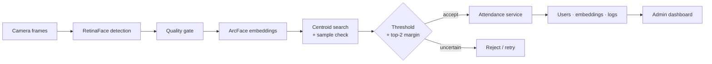

**기존 얼굴 출결 시스템에 등록 품질 관리와 모호한 후보 거절을 추가한 고도화 사례입니다.**

> 기존 애플리케이션을 분석하고 식별 판정과 출결 흐름을 개선한 작업입니다. 실제 얼굴 이미지, 임베딩, DB 설정과 애플리케이션 소스는 공개하지 않습니다.

## 문제

얼굴 인식 모델의 top-1 결과를 그대로 출석 처리에 쓰면 흐린 등록 사진, 비슷한 후보와 중복 검출 때문에 잘못된 기록이 남을 수 있습니다. 실제 테스트에서도 닮은 얼굴이 조명, 대비와 촬영 위치에 따라 잘못 승인되는 사례가 있었습니다.

식별에서 이름을 반환하는 것만으로 출결 업무가 끝나지도 않습니다. 승인된 사용자를 최근 기록과 연결해 IN 또는 OUT 상태를 결정하고, 관리자 화면과 로그까지 일관되게 갱신해야 합니다. 이 프로젝트에서는 기존 시스템을 등록, 식별, 승인, 기록 단계로 나누고 오승인 가능성이 큰 지점을 보강했습니다.

## 고도화 내용

### 여러 frame으로 등록 품질 관리

한 장의 등록 사진은 흐림, 각도와 표정에 크게 좌우됩니다. 짧은 구간에서 여러 frame을 수집하고 품질 기준을 통과한 sample만 등록에 사용했습니다. Centroid로 후보를 빠르게 찾은 뒤 원본 sample과 다시 비교해 한 사람 안에서도 달라지는 모습을 반영했습니다.

등록 단계에는 다양한 sample을 남기되 반복 호출되는 출결 단계는 가볍게 유지하도록 계산량을 나눴습니다. 구현 과정에서 사용한 선명도 약 `35`는 운영 환경에서 보정이 끝난 기준이 아니라 초기 품질 gate의 예시값입니다.

### 최고 점수와 후보 간 차이를 함께 확인

최고 similarity가 임계값을 넘더라도 두 후보의 점수가 비슷하면 신원을 확정하기 어렵습니다. Top-1과 top-2의 차이까지 확인하고 모호한 경우에는 출석을 기록하지 않고 재촬영을 요청했습니다. 잘못된 출석을 나중에 수정하는 비용이 한 번 더 촬영하는 비용보다 크다고 판단했습니다.

구현 예시값은 similarity threshold `0.68`, margin `0.03`입니다. 이 값은 데이터로 FAR과 FRR을 보정한 운영 기준이 아닙니다.

### 식별 결과를 출결 상태에 연결

승인된 identity는 최근 attendance log를 기준으로 IN 또는 OUT으로 전환됩니다. 사용자, 임베딩과 출결 기록은 관계형 모델에서 분리하고 FastAPI, SQLAlchemy, MariaDB와 React 관리 화면으로 연결했습니다. Single-face와 multi-face 입력, 중복 정리와 보조적인 smile·blink liveness signal도 같은 흐름 안에서 다뤘습니다.

## 구조

## 공개 범위와 남은 검증

이 저장소는 완성 제품의 배포 저장소가 아니라 기존 시스템에서 어떤 문제를 발견했고 어떤 판단 규칙을 추가했는지 정리한 case study입니다. 공개 자료만으로 실행하거나 성능을 재현할 수는 없습니다.

운영에 적용하려면 실제 사용 환경에서 FAR·FRR calibration, spoof 공격, 동시 요청, 권한 분리와 배포 구성을 검증해야 합니다. 생체정보에 대한 사용자 동의, 접근 통제, 암호화와 보관·삭제 정책도 필요합니다. 항목별 계획은 [Evaluation and deployment roadmap](docs/LEARNING_ROADMAP.md)에 있습니다.

## 작업 범위

기존 출결 시스템의 사용자 흐름과 식별 과정을 분석하고, 닮은 얼굴의 오승인 사례를 바탕으로 multi-frame 등록, sample 재비교와 ambiguity rejection을 설계했습니다. API·DB·frontend 연결과 테스트에는 Codex를 활용했으며, 생체정보가 포함된 원본과 공개 가능한 설계 자료의 경계도 정했습니다. 기여 범위는 기존 시스템 이후의 고도화 작업입니다.
