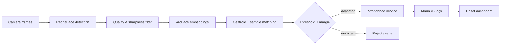

# Face Attendance System

**실시간 얼굴 등록·식별·출결 처리를 하나의 웹 애플리케이션으로 구현한 Full-Stack AI 프로젝트**

## 프로젝트 요약

카메라 입력에서 얼굴을 검출하고 사용자를 식별한 뒤 출근·퇴근 기록까지 연결하는
end-to-end 애플리케이션입니다. 단일 사진 비교에 그치지 않고 등록 품질, 다중 프레임,
판정 여유도, 간단한 liveness 신호와 데이터베이스 기록을 함께 설계했습니다.

| 영역 | 구현 |
|---|---|
| 얼굴 검출 | RetinaFace |
| 얼굴 표현 | ArcFace embedding |
| 식별 판정 | cosine threshold `0.68` + top-1/top-2 margin `0.03` |
| 등록 품질 | 다중 프레임, 선명도 필터, centroid 후보 + 개별 샘플 재검증 |
| Liveness | 눈 깜빡임·미소 기반 보조 신호 |
| Backend | FastAPI, SQLAlchemy, MariaDB |
| Frontend | React, TypeScript, Vite |
| 상태 | 프론트엔드 production build 및 백엔드 구문 검증 완료 |

## 시스템 흐름

## 핵심 설계

### 1. 등록 품질을 먼저 관리

한 장의 우연히 잘 나온 사진에 의존하지 않도록 여러 프레임을 수집하고,
흐리거나 품질이 낮은 프레임을 제외한 뒤 사용자 embedding을 구성했습니다.

### 2. 최고 점수만으로 승인하지 않음

top-1 유사도가 기준을 넘더라도 top-2와 차이가 작으면 모호한 판정입니다.
절대 임계값과 후보 간 margin을 함께 사용해 애매한 식별을 거절하도록 설계했습니다.

### 3. AI 결과를 실제 업무 흐름과 연결

식별 결과를 사용자·출결 모델과 연결하고, 출근/퇴근 상태 전환과 최근 로그 조회를
API와 웹 화면에서 처리하도록 구성했습니다.

## 주요 기능

- 다중 프레임 사용자 등록
- 단일·다중 얼굴 식별
- 실시간 카메라 출결
- 출근/퇴근 상태 전환
- 사용자·embedding·출결 로그 DB 관리
- liveness 설정 및 상태 확인
- 관리자용 로그·사용자 화면

## 엔지니어링 포인트

- 모델 추론과 HTTP/API 계층을 service/router 구조로 분리
- 환경별 DB URL과 프론트 API 주소를 환경변수로 관리
- 이미지·embedding·개인정보 파일은 저장소 공개 대상에서 제외
- 얼굴 인식 임계값은 보편적 기준이 아니라 이 프로젝트 설정값으로 명시

## 개인정보·운영 한계

얼굴 embedding도 생체정보이므로 실제 운영에는 명시적 동의, 보관 기간,
접근 통제, 암호화와 삭제 절차가 필요합니다. 미소·눈 깜빡임 liveness는
정교한 위조 공격 방어를 보장하지 않으며 별도 anti-spoofing 검증이 필요합니다.

## 담당 역할

문제 정의, 등록·식별 흐름, 판정 규칙, API·DB·프론트엔드 통합과 테스트를 주도했습니다.
AI 코딩 도구는 구현과 디버깅에 활용했고, 최종 구조와 판정 기준은 직접 검토했습니다.

[학습 및 운영 확장 계획](docs/LEARNING_ROADMAP.md)
