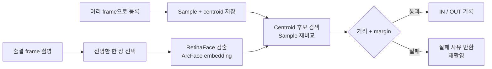

# Face Attendance System Upgrade

[English](README.en.md)

닮은 사용자를 잘못 승인한 사례를 바탕으로 기존 얼굴 출결 시스템을 고도화했습니다. 여러 촬영 조건을 등록 데이터에 남기고, 가장 가까운 후보가 다른 사용자와 충분히 구분되는지까지 확인하도록 판정 구조를 바꿨습니다.

핵심은 **얼굴이 비슷한 두 후보를 억지로 한 사람으로 확정하지 않는 것**입니다. 후보 간 거리 차이인 margin gap을 승인 조건에 추가하고, 애매한 경우에는 출결 기록을 남기지 않도록 구현했습니다.


[고도화 배경](#왜-승인-기준을-다시-봤는가) · [설계](#등록-검색-승인을-나눠-개선) · [구현](#구현한-사용-흐름) · [실행](#로컬에서-실행하기) · [검증 범위](#확인한-범위와-남은-평가)

## 왜 승인 기준을 다시 봤는가

얼굴을 등록한 사용자가 카메라 앞에서 출근·퇴근을 기록하는 상황을 가정했습니다. 기존 시스템은 사용자당 대표 임베딩 하나를 저장하고, 가장 가까운 후보의 거리가 임계값보다 작으면 승인했습니다.

조명과 촬영 위치를 바꿔 테스트하다가 닮은 사람이 잘못 승인되는 사례를 확인했습니다. 1순위 후보가 가깝더라도 2순위와 거의 차이가 없다면, 거리 임계값 하나로 누구인지 확정하기 어렵다고 봤습니다.

잘못 기록한 출결을 나중에 수정하는 비용과 한 번 더 촬영하는 비용을 비교해, 애매한 경우에는 재시도를 요청하는 방향을 선택했습니다. 등록 표현, 후보 검색과 승인 기준을 함께 살폈고, 관리자가 실패 원인을 확인할 수 있도록 로그와 조회 화면도 연결했습니다.

## 등록·검색·승인을 나눠 개선

| 관찰한 문제 | 선택한 방법 | 기대한 효과 |
|---|---|---|
| 한 장의 사진으로 촬영 편차를 대표하기 어려움 | 여러 frame의 sample embedding과 평균 centroid 저장 | 등록할 때 확인한 다양한 얼굴 표현을 비교에 사용 |
| 모든 sample을 비교하면 등록 규모에 따라 비교량 증가 | Centroid로 Top-5 사용자 검색 후 해당 sample 재비교 | 최종 sample 비교 대상을 후보 사용자로 제한 |
| 1·2순위가 비슷해도 거리 임계값만 통과하면 승인 | Threshold와 사용자 간 margin gate를 함께 적용 | 애매한 후보를 거절하고 재촬영 유도 |
| 여러 frame의 embedding을 매번 생성 | 출결에서는 가장 선명한 frame 하나 선택 | 반복 출결의 embedding 계산 횟수 축소 |
| 한 이미지의 여러 얼굴이 같은 사용자로 식별 | 사용자별 가장 좋은 결과 하나만 기록 | 같은 요청 안에서 IN/OUT이 두 번 바뀌는 문제 방지 |

등록은 자주 반복하지 않으므로 여러 sample을 남기고, 출결은 반복되므로 best-frame 한 장을 사용했습니다. Centroid는 검색에, 실제 sample은 최종 거리 계산에 쓰도록 역할을 나눴습니다. 기대한 정확도·응답시간 개선 폭은 별도 데이터로 측정해야 합니다.

### Margin gap은 어떻게 쓰는가

후보별 sample 거리 중 최솟값을 해당 사용자의 거리로 두고, 서로 다른 사용자의 1·2순위를 비교합니다.

```text
d1 = 가장 가까운 사용자의 cosine distance
d2 = 두 번째로 가까운 사용자의 cosine distance
margin = d2 - d1

현재 승인 조건: d1 < 0.68 AND margin >= 0.03
```

현재 수치는 프로토타입 설정값입니다. 유효 후보 사용자가 한 명뿐이면 margin 검사를 건너뛰고 거리만 확인합니다. 판정 결과에는 `threshold`, `margin_gate`, `no_candidates` 같은 실패 사유를 남깁니다.

구현은 [사용자 단위 matching](backend/app/services/face_service.py)의 `find_closest_match_user_level_with_reason`에서 확인할 수 있습니다. 등록과 단일·다중 얼굴 판정의 상세 흐름은 [설계 문서](docs/DESIGN.md)에 정리했습니다.

## 구현한 사용 흐름


```mermaid
flowchart LR
    R["여러 frame으로 등록"] --> S["Sample + centroid 저장"]
    C["출결 frame 촬영"] --> B["선명한 한 장 선택"]
    B --> E["RetinaFace 검출<br/>ArcFace embedding"]
    S --> H["Centroid 후보 검색<br/>Sample 재비교"]
    E --> H
    H --> G{"거리 + margin"}
    G -->|통과| A["IN / OUT 기록"]
    G -->|실패| L["실패 사유 반환<br/>재촬영"]
```

FastAPI backend와 React 화면을 연결해 등록부터 출결 기록, 사용자·로그 조회까지 실행할 수 있습니다.

- `/register`: 다중 frame 등록. 얼굴 검출에 실패하거나 sharpness가 낮은 frame은 저장에서 제외합니다.
- `/`: V4 출결. 3~5개 frame 중 선명한 한 장으로 식별하고 IN/OUT을 전환합니다.
- `/multi`, `/multi-live`: 여러 얼굴을 식별하거나 사용자별 출결을 기록합니다.
- `/db`, `/logs`: 등록 사용자 관리와 서버 로그 확인.
- 선택적 liveness: 미소 기반 검사와 MediaPipe Face Landmarker의 blink 검사.

[API guide](backend/ATTENDANCE_API_GUIDE.md)에는 경로별 입력, 출결 전환 규칙과 실패 조건이 있습니다. [트러블슈팅](backend/TROUBLESHOOTING.md)에는 MediaPipe Tasks API 전환, DB 접근 설정과 다중 이미지 업로드 문제를 기록했습니다.

## 로컬에서 실행하기

### MariaDB 준비

전용 로컬 DB에서 [`backend/db_reset_v2.sql`](backend/db_reset_v2.sql)을 실행합니다. 이 스크립트는 `attendance_db`를 삭제하고 다시 만드므로 기존 데이터가 있는 DB에 실행하면 안 됩니다.

### Backend

CI의 Python 구문·경량 단위 검사는 3.12에서 실행합니다. 전체 DeepFace/TensorFlow 모델 추론은 이 CI에 포함하지 않습니다. 개발 당시 Python 3.13의 MediaPipe 호환 문제는 Tasks API로 전환했습니다.

```powershell
cd backend
Copy-Item .env.example .env
python -m venv .venv
.venv\Scripts\Activate.ps1
python -m pip install -r requirements.txt
uvicorn app.main:app --reload
```

`.env`에서 DB 계정과 `LIVENESS_ADMIN_PASSWORD`를 로컬 값으로 바꾸고, `CORS_ORIGINS`에 프론트엔드 주소를 지정합니다. API 문서는 `http://127.0.0.1:8000/docs`에서 확인합니다. Blink liveness에는 [별도 모델 파일](backend/models/README.md)이 필요합니다.

### Frontend

새 터미널에서 저장소의 `frontend` 폴더로 이동합니다.

```powershell
cd frontend
Copy-Item .env.example .env
npm ci
npm run dev
```

`http://127.0.0.1:5173`에서 화면을 열고, 등록 후 출결을 실행합니다. 카메라와 MariaDB, 얼굴 모델이 필요한 로컬 앱이며 공개 hosted demo는 제공하지 않습니다.

## 확인한 범위와 남은 평가

자동화 검사 범위는 Python 구문, 출결 IN/OUT 전환과 liveness 설정 단위 테스트, TypeScript/Vite 빌드입니다. 공개 코드에서는 margin gate, 다중 sample 등록, 후보 검색과 요청 내 사용자 중복 제거를 확인할 수 있습니다.

실제 얼굴 데이터셋을 사용한 Accuracy·FAR·FRR, threshold/margin 보정, 고도화 전후 latency와 부하 검증은 아직 없습니다. 특히 Top-k에서 정답 사용자를 놓치는 비율과 margin을 높일 때 늘어나는 본인 거절률을 함께 측정해야 합니다. 현재 구현을 정확도 향상 수치로 표현하지 않았습니다.

공개본은 로컬 연구용 프로토타입입니다. 사용자·로그 관리 API 인증, HTTPS, embedding 암호화와 보관 정책은 포함하지 않았습니다. 동시 요청 사이의 중복 출결도 검증하지 않았습니다. 후속 항목은 [평가·운영 계획](docs/LEARNING_ROADMAP.md)에 정리했습니다.

실제 얼굴 이미지·embedding, DB 계정, 관리자 비밀번호, 모델 가중치와 로그는 Git에서 제외합니다.
