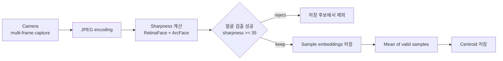
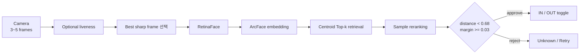
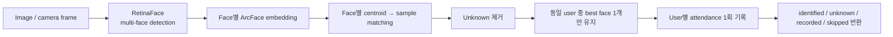

# 등록과 출결 판정 설계

[프로젝트 소개와 실행](../README.md) · [API guide](../backend/ATTENDANCE_API_GUIDE.md)

기존 출결 시스템에서 관찰한 오승인을 등록 데이터, 후보 검색과 승인 기준으로 나눠 개선한 설계다. 아래 수치는 현재 코드의 설정값이며, 운영 데이터로 보정한 성능 기준은 아니다.

## 설계 선택

### 여러 프레임으로 등록 데이터 구성

한 장의 정면 사진만 저장하면 촬영 조건 변화에 취약할 수 있다고 판단했습니다. 등록 시 여러 프레임의 Laplacian variance 기반 sharpness와 ArcFace embedding을 계산합니다. 얼굴을 검출하지 못했거나 sharpness가 기준보다 낮은 프레임은 저장 후보에서 제외하고 유효 sample만 남깁니다.

유효 sample들의 평균으로 사용자 **centroid**를 함께 만들었습니다.

- sample embedding: 실제 촬영 조건별 사용자 표현
- centroid: 후보 검색을 위한 대표 벡터

centroid 하나로 사용자를 완전히 대표하려는 것이 아니라, **centroid는 검색용, sample은 최종 검증용**으로 역할을 분리했습니다.

### Threshold와 후보 간 margin을 함께 확인

초기 방식에서는 가장 가까운 후보의 distance가 threshold를 통과하면 승인했습니다. 하지만 Top-1과 Top-2가 거의 비슷한 경우에도 한 사람을 강제로 선택할 수 있습니다.

현재는 두 조건을 함께 봅니다.

1. Top-1 후보가 충분히 가까운가?
2. Top-2 후보와 충분히 구분되는가?

현재 코드의 예시 기준은 cosine distance `< 0.68`, margin gap `>= 0.03`입니다. Margin은 같은 사용자의 서로 다른 사진끼리가 아니라 서로 다른 사용자 사이에서 계산합니다. 유효 후보 사용자가 한 명만 남으면 margin 검사를 건너뛰고 거리 조건만 적용합니다. 이 값들은 운영 데이터에서 FAR/FRR을 측정해 calibration한 최종값이 아니라 **현재 프로토타입의 decision rule**입니다.

이 선택에는 잘못된 출결을 나중에 수정하는 비용이 한 번 더 촬영하도록 요청하는 비용보다 크다는 판단도 반영했습니다. 따라서 후보가 애매하면 가장 가까운 사용자를 강제로 승인하지 않고 재시도로 보냅니다.

### Centroid 검색 뒤 sample 재검증

모든 사용자의 모든 sample embedding을 처음부터 비교하면 등록 sample이 늘수록 비교량도 함께 커집니다. 반대로 centroid만 최종 판정에 사용하면 평균 벡터가 실제 얼굴 sample을 충분히 대표하지 못할 수 있습니다.

그래서 두 단계를 결합했습니다.

1. centroid 거리로 Top-k 사용자 후보를 빠르게 선택
2. 후보 사용자들의 실제 sample embedding을 다시 비교해 최종 순위 계산

Centroid는 1차 후보 검색에, sample은 후보 사용자의 최종 거리 계산에 사용합니다. Centroid 단계에서 정답 사용자가 Top-k 밖으로 밀리면 sample 단계에서 복구할 수 없으므로 후보 검색 recall도 별도로 평가해야 합니다.

### 등록과 반복 출결의 계산량 분리

등록은 사용자당 한 번 또는 드물게 수행되지만 출결 inference는 반복됩니다. 따라서 두 단계에 같은 계산량을 쓰지 않았습니다.

- 등록: 여러 frame을 사용해 사용자 표현을 넓힘
- 출결: 여러 frame 중 가장 sharp한 한 장만 embedding

V3에서는 여러 frame embedding을 평균내는 방식도 실험했지만, V4에서는 반복 inference의 계산량을 줄이는 방향으로 best-frame 전략을 선택했습니다.

## 등록부터 출결까지의 흐름

### Registration pipeline

등록 단계에서는 흐린 프레임과 얼굴 검출 실패 프레임을 제외하고, 최소 1개 이상의 유효 프레임이 남으면 등록합니다. 개별 sample과 centroid를 함께 남겨 이후 후보 검색과 재검증에 사용합니다.

### Single-person attendance

출결에서는 가장 선명한 frame 하나만 embedding하고, centroid로 후보를 줄인 뒤 sample을 재비교합니다. threshold 또는 margin 조건을 만족하지 못하면 출결 기록을 남기지 않습니다.

### Multi-person attendance

한 이미지에서 여러 얼굴을 검출하고 얼굴별로 동일한 hybrid matching을 수행합니다. 같은 사용자가 여러 검출 결과에 매핑되면 가장 좋은 결과 하나만 남겨 **한 프레임에서 같은 사람의 IN/OUT이 반복 토글되는 문제**를 막습니다.

## 구현 위치

| 영역 | 현재 구현 |
|---|---|
| 얼굴 표현 | RetinaFace로 얼굴을 찾고 ArcFace로 512차원 embedding 생성 |
| 사용자 등록 | 3~10개 frame을 받아 sharpness 35 미만을 제외하고 sample embedding과 centroid 저장 |
| 후보 검색 | centroid 거리로 상위 5명을 고른 뒤 각 후보의 sample embedding 재비교 |
| 승인 조건 | cosine distance `< 0.68` + 서로 다른 사용자의 Top-1·Top-2 margin gap `>= 0.03` |
| 출결 처리 | 3~5개 frame 가운데 가장 sharp한 한 장으로 embedding 생성 |
| 여러 얼굴 | 얼굴별 식별 후 같은 user가 한 이미지에서 두 번 기록되지 않도록 deduplication |
| 출결 전환 | 최근 기록이 없거나 OUT이면 IN, 최근 기록이 IN이면 OUT |
| 라이브니스 | 미소 기반 방식과 MediaPipe Face Landmarker의 blink 방식 |
| 운영 기능 | 등록, 출결, multi-image identify, multi-live attendance, 사용자 조회·삭제, 서버 로그 |
| 성능 보조 | `.npy` embedding memory cache |

### 코드에서 확인할 위치

- [`FaceAnalysisService.create_embedding`](../backend/app/services/face_service.py): RetinaFace 검출과 ArcFace embedding 생성
- [`find_closest_match_user_level_with_reason`](../backend/app/services/face_service.py): threshold와 margin을 함께 보는 판정
- [`register_user_v2`](../backend/app/routers/face.py): multi-frame 등록과 centroid 생성
- [`check_in_out_v4`](../backend/app/routers/attendance.py): best-frame 기반 출결
- [`check_in_out_multi_image`](../backend/app/routers/attendance.py): multi-face 판정과 사용자 중복 제거
